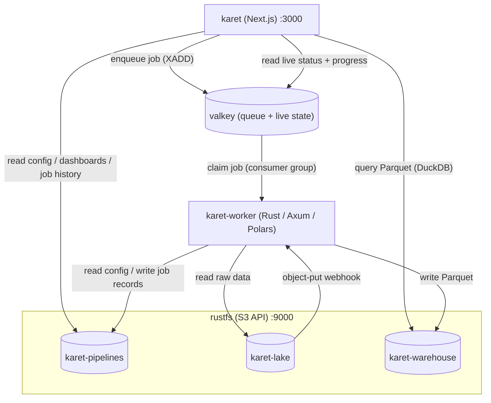

# Architecture

Karet is four services orchestrated by Docker Compose: three S3 buckets
hold all durable data, and a Valkey instance coordinates the job queue.

| Service | Stack | Role |
|---------|-------|------|
| **rustfs** | [RustFS](https://rustfs.com) | S3-compatible object store. Hosts the three Karet buckets and posts upload events to the worker. |
| **valkey** | [Valkey](https://valkey.io) | Job queue (Redis stream), live job state, and webhook debounce. Coordination only. Losing it never loses history. |
| **karet-worker** | Rust / Axum / Polars | Consumes jobs from the queue, ingests source CSVs, applies AST-JSON mapping expressions via Polars, writes partitioned Parquet, and owns the job lifecycle end to end. |
| **karet** | Next.js / React Flow / Chart.js | Renders the UI (pipeline list, graph editor, jobs, data, dashboards), queries the warehouse with DuckDB, enqueues manual runs, and owns auth. |



## The job queue

Jobs travel over a Redis stream (`karet:jobs:stream`), never over HTTP:

1. **Enqueue.** A manual run (web) or a debounced upload event (worker)
   adds a message to the stream and creates a live-state hash
   (`karet:jobs:live:<id>`) with `status: queued`.
2. **Claim.** A worker claims the message via a consumer group, takes a
   per-pipeline lock (`SET NX` with heartbeat renewal) so at most one
   run per pipeline executes cluster-wide, and marks the job `running`.
3. **Execute.** The config is validated, CSVs ingested, and progress
   (stage, file/mapping counters) streamed into the live hash. The Jobs
   page polls it.
4. **Finish.** The worker writes the terminal record to S3
   (`pipelines/<slug>/jobs/<id>.json`), updates the live hash (24 h
   TTL), releases the lock, and acks the message.

Failures retry with exponential backoff (up to `MAX_ATTEMPTS`, default
3). If a worker crashes mid-run, its unacked message idles in the
pending-entries list until another worker reclaims and re-runs it.
Runs are idempotent (the same partition keys are rewritten), so
at-least-once delivery is safe.

**Division of state:** Valkey holds coordination data (queue, live
status, debounce timers) that is small, hot, and expendable; S3 holds
history that is durable and unbounded. A Valkey crash loses at most ~1
second of coordination writes (AOF `everysec`): a queued-but-unstarted
job, never a job record.

## The three buckets

Splitting by data class lets you set different lifecycle, access, and cost
policies per bucket.

| Bucket | Env var | Holds |
|--------|---------|-------|
| `karet-pipelines` | `S3_BUCKET_PIPELINES` | Pipeline configs, dashboards, saved queries, job records. |
| `karet-lake` | `S3_BUCKET_LAKE` | Raw CSV files you upload. |
| `karet-warehouse` | `S3_BUCKET_WAREHOUSE` | Query-ready partitioned Parquet. |

## Design notes

- **All durable state lives in S3.** No database to back up. Valkey is
  rebuildable coordination state (its volume is worth persisting, but
  losing it costs queued jobs, not data).
- **The worker owns the job lifecycle**, including the webhook receiver
  for RustFS upload events and every job-record write. The web service
  only enqueues and reads.
- **The admin credential lives in the environment**
  (`KARET_ADMIN_PASSWORD_HASH`), not in a bucket. See
  [Authentication](./authentication).

## What lives where in S3

Each bucket keys objects under `pipelines/<slug>/`, so a pipeline's data
lines up across the three buckets:

```
karet-pipelines  pipelines/<slug>/pipeline.json          # sources + mappings + tables
                 pipelines/<slug>/dashboards/*.json       # one per dashboard
                 pipelines/<slug>/queries/*.json          # one per saved query
                 pipelines/<slug>/jobs/job-<ts>-<rand>.json  # terminal job records
                 pipelines/<slug>/preview.png             # home-page thumbnail

karet-lake       pipelines/<slug>/transactions/*.csv     # raw inputs you upload

karet-warehouse  pipelines/<slug>/<table>/year=YYYY/month=MM/<mapping>.parquet
```

## Trust boundaries

- The web service binds publicly (port 3000 on the host). Its
  unauthenticated surface is `/login` and `/api/auth/*` only, and the
  login endpoint is rate-limited.
- The worker is reachable only over the compose network. Its
  `POST /config/validate` requires a bearer token
  (`KARET_WORKER_TOKEN`); `POST /events/s3` requires the webhook secret;
  `/health` is open for probes.
- Valkey is on an internal network reachable only by the web and worker
  services. Access to it is access to the job queue, so don't put it on
  a shared network.
- RustFS is exposed for local dev convenience but doesn't need to be.
- Job execution has no HTTP trigger. Only things that can write to the
  Redis stream can start a run.

See [Authentication](./authentication) for the admin password flow and
session cookies.
