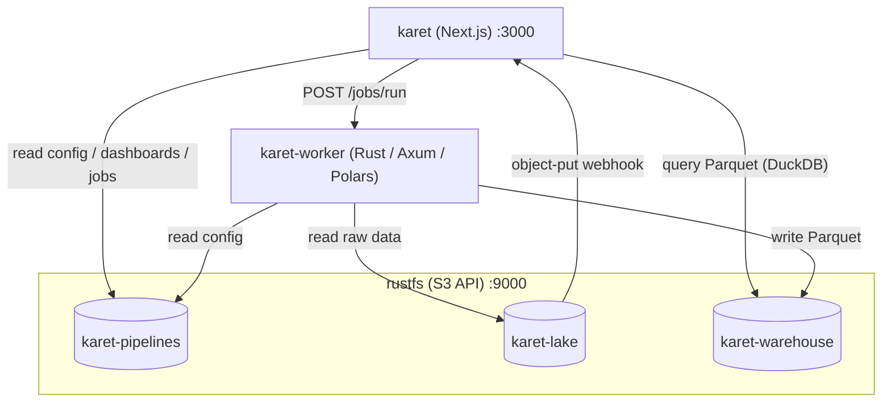

# Architecture

Karet is three services orchestrated by Docker Compose, backed by three S3 buckets.

| Service | Stack | Role |
|---------|-------|------|
| **rustfs** | [RustFS](https://rustfs.com) | S3-compatible object store. Hosts the three Karet buckets. |
| **karet-worker** | Rust / Axum / Polars | Reads a pipeline config, ingests source CSVs, applies AST-JSON mapping expressions via Polars, writes partitioned Parquet. |
| **karet** | Next.js / React Flow / Chart.js | Renders the UI (pipeline list, graph editor, jobs, data, dashboards), queries the warehouse with DuckDB, and owns auth. |



## The three buckets

Splitting by data class lets you set different lifecycle, access, and cost
policies per bucket.

| Bucket | Env var | Holds |
|--------|---------|-------|
| `karet-pipelines` | `S3_BUCKET_PIPELINES` | Pipeline configs, dashboards, job records, admin password hash. |
| `karet-lake` | `S3_BUCKET_LAKE` | Raw CSV files you upload. |
| `karet-warehouse` | `S3_BUCKET_WAREHOUSE` | Query-ready partitioned Parquet. |

## Design notes

- **All persistent state lives in S3.** No database to back up.
- **The web service holds the UI, auth, and the webhook receiver** for
  RustFS object events.
- **The worker is stateless.** It takes a `pipeline_prefix`, reads the config
  and raw source data, runs Polars, writes Parquet, and returns a result.

## What lives where in S3

Each bucket keys objects under `pipelines/<slug>/`, so a pipeline's data
lines up across the three buckets:

```
karet-pipelines  pipelines/<slug>/pipeline.json          # sources + mappings + tables
                 pipelines/<slug>/dashboards/*.json       # one per dashboard
                 pipelines/<slug>/queries/*.json          # one per saved query
                 pipelines/<slug>/jobs/job-<ts>-<rand>.json
                 pipelines/<slug>/preview.png             # home-page thumbnail
                 _auth/admin.json                         # scrypt-hashed admin password

karet-lake       pipelines/<slug>/transactions/*.csv     # raw inputs you upload

karet-warehouse  pipelines/<slug>/transactions/year=YYYY/month=MM/data.parquet
```

## Trust boundaries

- The web service binds publicly (port 3000 on the host).
- The worker is reachable only over the compose network.
- RustFS is exposed for local dev convenience but doesn't need to be; the
  web and worker services reach it over the compose network.
- The webhook from RustFS to web carries a shared secret
  (`KARET_WEBHOOK_SECRET`), so the receiver rejects unauthorized traffic
  even if port 3000 is exposed.

See [Authentication](./authentication) for the admin password flow and
session cookies.
