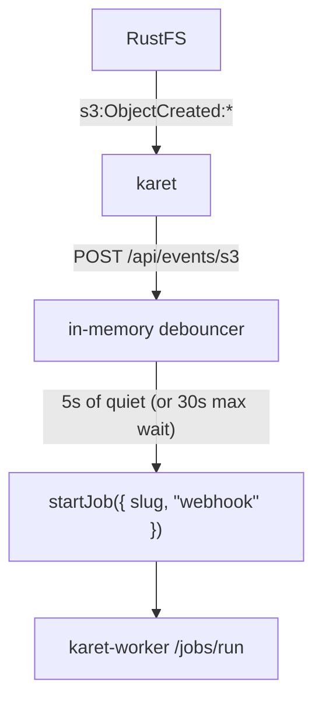

# Auto-runs (webhooks)

When you enable webhook notifications, uploading a CSV to a pipeline's raw
prefix automatically triggers a pipeline run. A small in-process debouncer
coalesces a batch upload (say, 12 monthly CSVs) into a single job.

## How it works



- The receiver lives at **`POST /api/events/s3`** in the web service.
- It verifies a shared secret (`KARET_WEBHOOK_SECRET`), parses the S3
  event payload, extracts the pipeline slug from each
  `pipelines/<slug>/...` key, and asks the debouncer to schedule a
  run.
- The debouncer fires after **5 seconds of quiet**, or after
  **30 seconds since the first event in the batch**, whichever comes first.
- Auto-runs show up in the **Jobs** page tagged with a small blue `auto`
  chip. Manual runs are unchanged.

## Setup

### 1. Generate a secret

```sh
echo "KARET_WEBHOOK_SECRET=$(openssl rand -hex 32)" >> .env
```

The compose file passes this value to both `rustfs` (which appends it as
a `?secret=` query param) and `karet` (which verifies it).

### 2. Restart the stack

```sh
docker compose up -d --force-recreate
```

This picks up the new env vars.

### 3. Subscribe the bucket to the webhook target

RustFS doesn't auto-subscribe. You have to call
`PutBucketNotificationConfiguration` once. The repo ships with a script:

```sh
./scripts/setup-rustfs-webhook.sh
```

This subscribes `s3://karet-lake` to `arn:rustfs:sqs::primary:webhook` for
all `ObjectCreated:*` events on `*.csv` keys. The subscription persists
across RustFS restarts (it's stored in bucket metadata).

### 4. Test it

Upload a CSV to any pipeline's raw prefix in the lake bucket:

```sh
aws --endpoint-url=http://localhost:9000 \
  s3 cp test.csv s3://karet-lake/pipelines/<slug>/transactions/
```

Within ~5 seconds, a new job appears on the Jobs page with an `auto` chip.

## Scaling out

The debouncer state is a `Map<slug, Timer>` in module scope. If web
restarts mid-debounce the timer is lost, but the next upload re-triggers
it and the pipeline is idempotent.

This only works with a single `web` replica. Behind a load balancer,
events for one slug can hit different replicas and each keeps its own
timer, defeating the debounce, so move the map to Redis or a Postgres
advisory lock first.

## Disabling

Leave `KARET_WEBHOOK_SECRET` empty in `.env`. The receiver fails closed
(returns 401 on every request), and RustFS has nowhere to deliver to.
