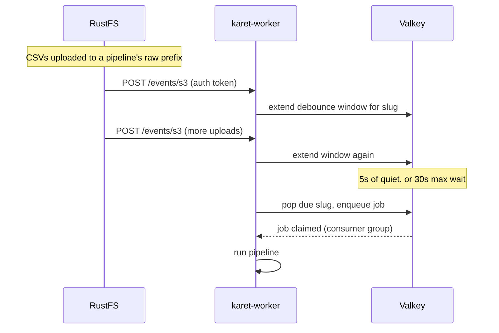

# Auto-runs (webhooks)

Uploading a CSV to a pipeline's raw prefix automatically triggers a
pipeline run. A debouncer coalesces a batch upload (say, 12 monthly
CSVs) into a single job.

The receiver lives in the worker and the debounce state lives in
Valkey. The web service is not involved.

## How it works



- RustFS posts S3 event payloads to **`POST /events/s3`** on the worker,
  authenticated by `KARET_WEBHOOK_SECRET` in a header
  (`RUSTFS_NOTIFY_WEBHOOK_AUTH_TOKEN_PRIMARY` sends it as a bearer
  token). The secret is required; the endpoint fails closed without
  it.
- The worker filters to object-created events in the lake bucket,
  extracts the pipeline slug from each `pipelines/<slug>/...` key, and
  extends that slug's debounce window in Valkey.
- The debounce fires after **5 seconds of quiet**, or after **30 seconds
  since the first event in the batch**, whichever comes first, then
  enqueues a job like any manual run.
- Auto-runs show up in the **Jobs** page tagged with a small blue `auto`
  chip. Manual runs are unchanged.

## Setup

The bundled compose file wires the target for you (worker endpoint, auth
token header, outbound allow-list). Two things are still required:

### 1. Set the secret

```sh
echo "KARET_WEBHOOK_SECRET=$(openssl rand -hex 32)" >> .env
docker compose up -d
```

The compose file passes it to `rustfs` (as the webhook auth token) and
to the worker (which verifies it). The worker refuses to start without
it.

### 2. Subscribe the bucket to the webhook target

A webhook target alone delivers nothing. The lake bucket needs a
notification rule, applied once with the AWS CLI:

```sh
aws --endpoint-url http://localhost:9000 --region us-east-1 \
  s3api put-bucket-notification-configuration \
  --bucket karet-lake --notification-configuration '{
  "QueueConfigurations": [{
    "Id": "karet-worker-webhook",
    "QueueArn": "arn:rustfs:sqs:us-east-1:primary:webhook",
    "Events": ["s3:ObjectCreated:*"],
    "Filter": {"Key": {"FilterRules": [
      {"Name": "prefix", "Value": "pipelines/"},
      {"Name": "suffix", "Value": ".csv"}
    ]}}
  }]}'
```

The rule persists in bucket metadata across restarts.

::: warning RustFS version quirk
Some RustFS versions (observed on `1.0.0-rc.3`) load bucket notification
rules only at startup. A freshly applied rule does nothing until you
`docker compose restart rustfs`. Newer releases apply rules dynamically.
If uploads don't trigger runs, restart RustFS first.
:::

RustFS also health-checks the webhook origin with a `HEAD /` probe and
only delivers to origins in `RUSTFS_OUTBOUND_ALLOW_ORIGINS` (set in the
compose file). Both are handled by the bundled setup; remember them if
you deviate.

### 3. Test it

Upload a CSV to any pipeline's raw prefix in the lake bucket:

```sh
aws --endpoint-url=http://localhost:9000 \
  s3 cp test.csv s3://karet-lake/pipelines/<slug>/transactions/
```

Within ~5 seconds the worker logs `debounced upload event`, and a new
job appears on the Jobs page with an `auto` chip.

## Scaling out

Debounce state lives in a Valkey sorted set, not process memory, so it
survives worker restarts and works with any number of worker replicas.
The due-window pop is atomic: a batch fires exactly one job no matter
how many workers race for it. Web replicas don't matter here; the web
service doesn't participate in this flow.

## Disabling

Remove the bucket notification rule:

```sh
aws --endpoint-url http://localhost:9000 s3api \
  put-bucket-notification-configuration \
  --bucket karet-lake --notification-configuration '{}'
```

`KARET_WEBHOOK_SECRET` must stay set (the worker requires it), but with
no rule subscribed, no events are ever delivered.
